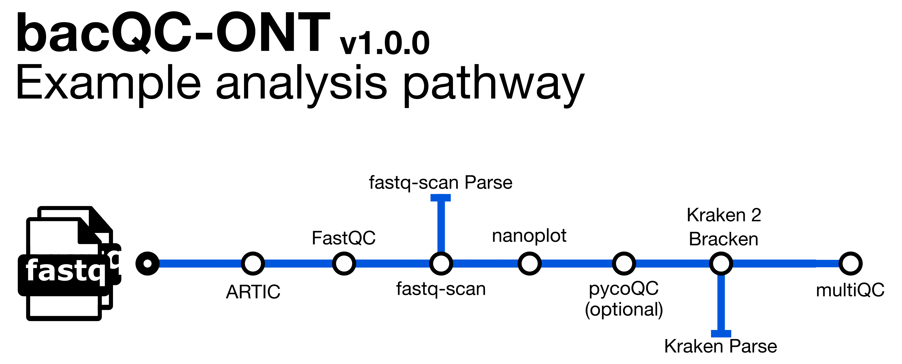

# 

[](https://doi.org/10.5281/zenodo.15040673)

[](https://www.nextflow.io/)
[](https://docs.conda.io/en/latest/)
[](https://www.docker.com/)
[](https://sylabs.io/docs/)
[](https://cloud.seqera.io/launch?pipeline=https://github.com/nf-core/taxprofiler)

## Introduction

**bacQC-ONT** is a bioinformatics pipeline for the assessment of Oxford Nanopore sequence data. It assesses read quality with `fastQC`, `nanoplot` and `pycoQC`, and species composition with `Kraken2` and `Bracken`.

1. Read QC ([`FastQC`](https://www.bioinformatics.babraham.ac.uk/projects/fastqc/))
2. Calculate fastq summary statistics ([`fastq-scan`](https://github.com/rpetit3/fastq-scan))
3. ONT Read QC and summary ([`NanoPlot`](https://github.com/wdecoster/NanoPlot))
4. ONT Read QC and summary ([`pycoQC`](https://tleonardi.github.io/pycoQC/)) [OPTIONAL - requires `sequencing_summary.txt` file]
5. Assign taxonomic labels to sequence reads ([`Kraken 2`](https://ccb.jhu.edu/software/kraken2/))
6. Re-estimate taxonomic abundance of samples analyzed by Kraken 2([`Bracken`](https://ccb.jhu.edu/software/bracken/))
7. Visualize Bracken reports with ([`Krona`](https://github.com/marbl/Krona))
8. Present QC and species composition ([`MultiQC`](http://multiqc.info/))

## Usage

> [!NOTE]
> If you are new to Nextflow and nf-core, please refer to [this page](https://nf-co.re/docs/usage/installation) on how to set-up Nextflow. Make sure to [test your setup](https://nf-co.re/docs/usage/introduction#how-to-run-a-pipeline) with `-profile test` before running the workflow on actual data.

You will need to download a taxonomic database for Kraken 2 and Bracken (this is a large file and may take a while):

```bash
wget ftp://ftp.ccb.jhu.edu/pub/data/kraken2_dbs/old/minikraken2_v1_8GB_201904.tgz

tar xvfz minikraken2_v1_8GB_201904.tgz
```
You will also need to download the taxonomy file for Krona (this requires Krona to be installed e.g. with Conda):

```bash
ktUpdateTaxonomy.sh .
```

You will need to create a samplesheet with information about the samples you would like to analyse before running the pipeline. It has to be a comma-separated file with 2 columns, and a header row as shown in the example below. An executable Python script called [`build_samplesheet.py`](https://github.com/avantonder/bacQC-ONT/blob/master/bin/build_samplesheet.py) has been provided to auto-create an input samplesheet based on a directory containing sub-directories with the prefix `barcode` which contain the FastQ files **before** you run the pipeline (requires Python 3 installed locally) e.g.

```bash
wget -L https://github.com/avantonder/bacQC-ONT/blob/master/bin/build_samplesheet.py

python build_samplesheet.py -i <FASTQ_DIR> 
```

```csv title="samplesheet.csv"
sample,fastq
SAMPLE_1,path/to/fastq/file1
SAMPLE_1,path/to/fastq/file2
SAMPLE_2,path/to/fastq/file1  
```

Now you can run the pipeline using: 

```bash
nextflow run avantonder/bacQC-ONT \
   -profile singularity \
   -c <INSTITUTION>.config \
   --input samplesheet.csv \
   --summary_file sequencing_summary.txt \
   --genome_size <ESTIMATED GENOME SIZE e.g. 4000000> \
   --kraken2db minikraken2_v1_8GB \
   --kronadb taxonomy.tab \
   --outdir <OUTDIR>
```

See [usage docs](docs/usage.md) for all of the available options when running the pipeline.

 Note that some form of configuration will be needed so that Nextflow knows how to fetch the required software. This is usually done in the form of a config profile (`<INSTITUTION>.config` in the example command above). You can chain multiple config profiles in a comma-separated string.

> - The pipeline comes with config profiles called `docker`, `singularity`, `podman`, `shifter`, `charliecloud` and `conda` which instruct the pipeline to use the named tool for software management. For example, `-profile test,docker`.
> - Please check [nf-core/configs](https://github.com/nf-core/configs#documentation) to see if a custom config file to run nf-core pipelines already exists for your Institute. If so, you can simply use `-profile <institute>` in your command. This will enable either `docker` or `singularity` and set the appropriate execution settings for your local compute environment.
> - If you are using `singularity`, please use the [`nf-core download`](https://nf-co.re/tools/#downloading-pipelines-for-offline-use) command to download images first, before running the pipeline. Setting the [`NXF_SINGULARITY_CACHEDIR` or `singularity.cacheDir`](https://www.nextflow.io/docs/latest/singularity.html?#singularity-docker-hub) Nextflow options enables you to store and re-use the images from a central location for future pipeline runs.
> - If you are using `conda`, it is highly recommended to use the [`NXF_CONDA_CACHEDIR` or `conda.cacheDir`](https://www.nextflow.io/docs/latest/conda.html) settings to store the environments in a central location for future pipeline runs.

## Documentation

The avantonder/assembleBAC-ONT pipeline comes with documentation about the pipeline [usage](docs/usage.md), [parameters](docs/parameters.md) and [output](docs/output.md).

## Acknowledgements

bacQC-ONT was originally written by Andries van Tonder. I wouldn't have been able to write this pipeline with out the tools, documentation, pipelines and modules made available by the fantastic [nf-core community](https://nf-co.re/).

## Feedback

If you have any issues, questions or suggestions for improving bovisanalyzer, please submit them to the [Issue Tracker](https://github.com/avantonder/bacQC-ONT/issues).

## Citations

If you use the avantonder/assembleBAC-ONT pipeline, please cite it using the following doi: [10.5281/zenodo.15040673](https://doi.org/10.5281/zenodo.15040673)

An extensive list of references for the tools used by the pipeline can be found in the [`CITATIONS.md`](CITATIONS.md) file.
