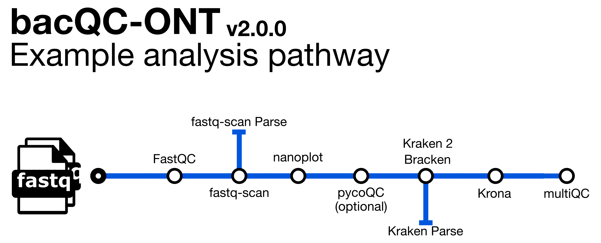

# 

[](https://www.nextflow.io/)
[](https://docs.conda.io/en/latest/)
[](https://www.docker.com/)
[](https://sylabs.io/docs/)
[](https://tower.nf/launch?pipeline=https://github.com/nf-core/bacqcont)

## Introduction

**bacQC-ONT** is a bioinformatics pipeline for the assessment of Oxford Nanopore sequence data. It assesses read quality with fastQC, nanoplot and pycoQC, and species composition with Kraken2 and Bracken.

1. Read QC ([`FastQC`](https://www.bioinformatics.babraham.ac.uk/projects/fastqc/))
2. Calculate fastq summary statistics ([`fastq-scan`](https://github.com/rpetit3/fastq-scan))
3. ONT Read QC and summary ([`NanoPlot`](https://github.com/wdecoster/NanoPlot))
4. ONT Read QC and summary ([`pycoQC`](https://tleonardi.github.io/pycoQC/)) [OPTIONAL - requires `sequencing_summary.txt` file]
5. Assign taxonomic labels to sequence reads ([`Kraken 2`](https://ccb.jhu.edu/software/kraken2/))
6. Re-estimate taxonomic abundance of samples analyzed by kraken 2([`Bracken`](https://ccb.jhu.edu/software/bracken/))
7. Present QC for raw reads ([`MultiQC`](http://multiqc.info/))

## Quick Start

1. Install [`Nextflow`](https://www.nextflow.io/docs/latest/getstarted.html#installation) (`>=23.04.0`)

2. Install any of [`Docker`](https://docs.docker.com/engine/installation/), [`Singularity`](https://www.sylabs.io/guides/3.0/user-guide/) (you can follow [this tutorial](https://singularity-tutorial.github.io/01-installation/)), [`Podman`](https://podman.io/), [`Shifter`](https://nersc.gitlab.io/development/shifter/how-to-use/) or [`Charliecloud`](https://hpc.github.io/charliecloud/) for full pipeline reproducibility _(you can use [`Conda`](https://conda.io/miniconda.html) both to install Nextflow itself and also to manage software within pipelines. Please only use it within pipelines as a last resort; see [docs](https://nf-co.re/usage/configuration#basic-configuration-profiles))_.

3. Download taxonomic databases for Kraken 2 and Bracken (this is a large file and may take a while):

   ```console
   wget ftp://ftp.ccb.jhu.edu/pub/data/kraken2_dbs/old/minikraken2_v1_8GB_201904.tgz

   tar xvfz minikraken2_v1_8GB_201904.tgz

4. You will need to create a samplesheet with information that maps sample ids to barcode ids before running the pipeline. It has to be a comma-separated file with 2 columns (An [example samplesheet](../assets/samplesheet.csv) has been provided with the pipeline.). A final samplesheet file may look something like the one below:

```console
sample,barcode
21X983255,1
70H209408,2
49Y807476,3
70N209581,4
```

5. Now, you can run the pipeline using a command like the one below:

```bash
nextflow run avantonder/bacQC-ONT \
   -profile singularity \
   -c <INSTITUTION>.config \
   --input samplesheet.csv \
   --fastq_dir path/to/fastq/files \
   --summary_file sequencing_summary.txt \
   --genome_size <ESTIMATED GENOME SIZE e.g. 4000000> \
   --kraken2db minikraken2_v1_8GB \
   --brackendb minikraken2_v1_8GB \
   --outdir <OUTDIR>
```

> **Warning:**
> Please provide pipeline parameters via the CLI or Nextflow `-params-file` option. Custom config files including those
> provided by the `-c` Nextflow option can be used to provide any configuration _**except for parameters**_;
> see [docs](https://nf-co.re/usage/configuration#custom-configuration-files).

## Documentation

The avantonder/bacQC-ONT pipeline comes with documentation about the pipeline [usage](https://github.com/avantonder/bacQC-ONT/blob/master/docs/usage.md), [parameters](https://github.com/avantonder/bacQC-ONT/blob/master/docs/parameters.md) and [output](https://github.com/avantonder/bacQC-ONT/blob/master/docs/output.md).

## Acknowledgements

bacQC-ONT was originally written by Andries van Tonder.

I wouldn't have been able to write this pipeline with out the tools, documentation, pipelines and modules made available by the fantastic [nf-core community](https://nf-co.re/).

## Feedback

If you have any issues, questions or suggestions for improving bovisanalyzer, please submit them to the [Issue Tracker](https://github.com/avantonder/bacQC-ONT/issues).

## Citations

An extensive list of references for the tools used by the pipeline can be found in the [`CITATIONS.md`](CITATIONS.md) file.

You can cite the `nf-core` publication as follows:

> **The nf-core framework for community-curated bioinformatics pipelines.**
>
> Philip Ewels, Alexander Peltzer, Sven Fillinger, Harshil Patel, Johannes Alneberg, Andreas Wilm, Maxime Ulysse Garcia, Paolo Di Tommaso & Sven Nahnsen.
>
> _Nat Biotechnol._ 2020 Feb 13. doi: [10.1038/s41587-020-0439-x](https://dx.doi.org/10.1038/s41587-020-0439-x).
