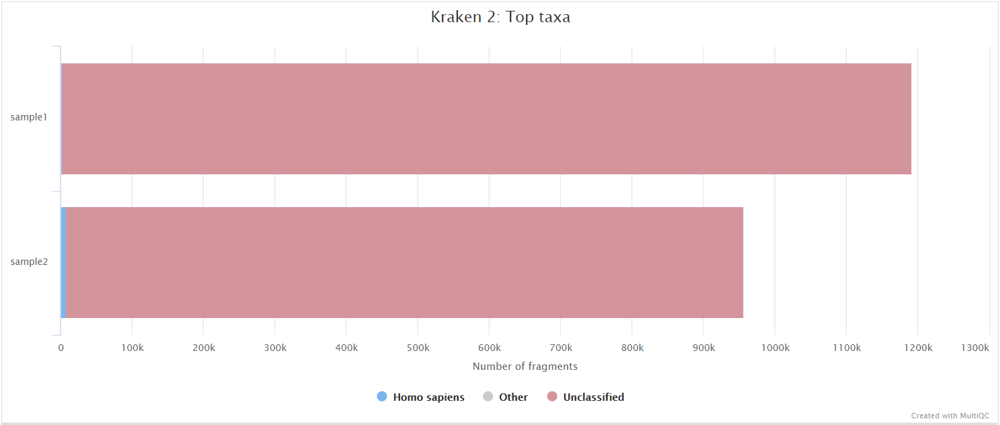

# avantonder/bacQC-ONT: Output

## Introduction

This document describes the output produced by the `bacQC-ONT` pipeline. The directories listed below will be created in the results directory after the pipeline has finished. All paths are relative to the top-level results directory.

## Pipeline overview

The pipeline is built using [Nextflow](https://www.nextflow.io/) and processes data using the following steps:

- [`FastQC`](#fastqc) - Raw read QC
- [`fastq-scan`](#fastq-scan) - Fastq summary statistics
- [`NanoPlot`](#nanoplot) - Read QC and summary
- [`pycoQC`](#pycoqc) - Read QC and summary
- [`Kraken 2`](#kraken-2) - Assign taxonomy to reads
- [`Bracken`](#bracken) - Re-estimate taxonomy
- [`kraken_parser.py`](#kraken-parser) - Species composition
- [`Krona`](#krona) - Visualize taxonomy
- [`read_stats_parser.py`](#read-stats-parser) - Sequencing statistics
- [`MultiQC`](#multiqc) - Aggregate report describing results and QC from the whole pipeline
- [`Pipeline information`](#pipeline-information) - Report metrics generated during the workflow execution

### FastQC

Output files

- `fastqc/`
  - `*_fastqc.html`: FastQC report containing quality metrics.
  - `*_fastqc.zip`: Zip archive containing the FastQC report, tab-delimited data file and plot images.

[FastQC](http://www.bioinformatics.babraham.ac.uk/projects/fastqc/) gives general quality metrics about your sequenced reads. It provides information about the quality score distribution across your reads, per base sequence content (%A/T/G/C), adapter contamination and overrepresented sequences. For further reading and documentation see the [FastQC help pages](http://www.bioinformatics.babraham.ac.uk/projects/fastqc/Help/).

> **NB:** The FastQC plots displayed in the MultiQC report shows _untrimmed_ reads. They may contain adapter sequence and potentially regions with low quality.

### fastq-scan

Output files

- `fastqscan/`
  - `raw/*.json`: JSON formatted file of summary statistics for input fastq files.
  - `trimmed/*.json`: JSON formatted file of summary statistics for trimmed fastq files.
- `metadata/`
  - `raw_fastq-scan_summary.tsv`: Final summary tsv file of sequencing statistics for input fastq files for all samples
  - `trim_fastq-scan_summary.tsv`: Final summary tsv file of sequencing statistics for trimmed fastq files for all samples

[fastq-scan](https://github.com/rpetit3/fastq-scan) is a tool for generating FASTQ summary statistics in JSON format.

### NanoPlot

Output files

- `nanoplot/`
  - Per-sample `*.html` files for QC metrics and individual `*.png` image files for plots.

[NanoPlot](https://github.com/wdecoster/NanoPlot) it a tool that can be used to produce general quality metrics from various Nanopore-based input files including fastq files e.g. quality score distribution, read lengths and other general stats.

### pycoQC

Output files

- `pycoqc/`
  - `*.html` and `.json` file that includes a run summary and graphical representation of various QC metrics including distribution of read length, distribution of read quality scores, mean read quality per sequence length, output per channel over experiment time and percentage of reads per barcode.

[PycoQC](https://github.com/a-slide/pycoQC) compute metrics and generate QC plots using the sequencing summary information generated by basecalling/demultiplexing tools such as Guppy e.g. distribution of read length, read length over time, number of reads per barcode and other general stats.

### Kraken 2

Output files

* `kraken2/`
    * `*.kraken2.report.txt`: Kraken 2 taxonomic report. See [here](https://ccb.jhu.edu/software/kraken2/index.shtml?t=manual#sample-report-output-format) for a detailed description of the format.

[Kraken 2](https://ccb.jhu.edu/software/kraken2/index.shtml?t=manual) is a sequence classifier that assigns taxonomic labels to DNA sequences. Kraken 2 examines the k-mers within a query sequence and uses the information within those k-mers to query a database. That database maps k-mers to the lowest common ancestor (LCA) of all genomes known to contain a given k-mer.

### Bracken

Output files

* `bracken/`
    * `*_S.tsv`: Bracken TSV output report of the re-estimated abundances. See [here](https://ccb.jhu.edu/software/bracken/index.shtml?t=manual) for a detailed description of the format.

[Bracken](https://ccb.jhu.edu/software/bracken/) (Bayesian Reestimation of Abundance with KrakEN) is a highly accurate statistical method that computes the abundance of species in DNA sequences from a metagenomics sample.

### kraken_parser.py

Output files

- `metadata/`
  - `species_composition.tsv`: Final summary tsv file of species composition for all samples.

[kraken_parser.py](https://github.com/avantonder/bacQC/blob/main/bin/kraken_parser.py) is a script used to summarise the results of Kraken 2 and Bracken for all samples.

### Krona

Output files

- `krona/`
  - `*.html`: HTML files containing taxonomy visualizations

[Krona](https://pubmed.ncbi.nlm.nih.gov/21961884/) creates interactive metagenomic visualizations in a Web browser.

## read_stats_parser.py

Output files

- `read_stats/`
  - `.tsv`: Pre- and post-trimming sequence statistics.
- `metadata`
  - `read_stats_summary.tsv`: Final summary tsv file of pre- and post-trimming sequence statistics for all samples.

### MultiQC

[MultiQC](http://multiqc.info) is a visualization tool that generates a single HTML report summarising all samples in your project. Most of the pipeline QC results are visualised in the report and further statistics are available in the report data directory.

Output files

- `multiqc/`
  - `multiqc_report.html`: a standalone HTML file that can be viewed in your web browser.
  - `multiqc_data/`: directory containing parsed statistics from the different tools used in the pipeline.
  - `multiqc_plots/`: directory containing static images from the report in various formats.

Results generated by MultiQC collate pipeline QC from supported tools e.g. FastQC. The pipeline has special steps which also allow the software versions to be reported in the MultiQC output for future traceability. For more information about how to use MultiQC reports, see <http://multiqc.info>.

All tools in bacQC supported by MultiQC will have a dedicated section showing summary statistics of each tool based on information stored in log files.

You can expect in the MultiQC reports either sections and/or general stats columns for the following tools:

- fastqc
- pycoqc
- kraken
- bracken

### Pipeline information

Output files

- `pipeline_info/`
  - Reports generated by Nextflow: `execution_report.html`, `execution_timeline.html`, `execution_trace.txt` and `pipeline_dag.dot`/`pipeline_dag.svg`.
  - Reports generated by the pipeline: `pipeline_report.html`, `pipeline_report.txt` and `software_versions.yml`. The `pipeline_report*` files will only be present if the `--email` / `--email_on_fail` parameter's are used when running the pipeline.
  - Reformatted samplesheet files used as input to the pipeline: `samplesheet.valid.csv`.
  - Parameters used by the pipeline run: `params.json`.

[Nextflow](https://www.nextflow.io/docs/latest/tracing.html) provides excellent functionality for generating various reports relevant to the running and execution of the pipeline. This will allow you to troubleshoot errors with the running of the pipeline, and also provide you with other information such as launch commands, run times and resource usage.